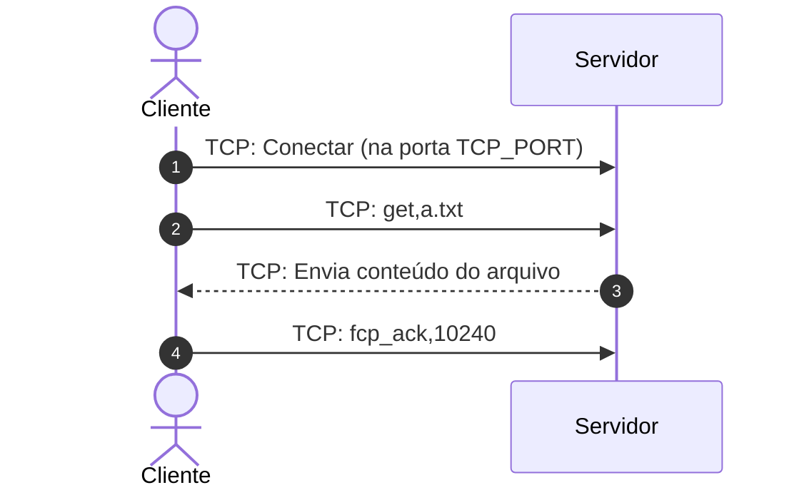

# Relatorio do Grupo ( G7 )

 - Copiando config.ini
- Iniciando o servidor: server.py
 - Servidor iniciado com PID: 31313
 - Saída do servidor salva em: server_output_G7.log

## Arquivos do Grupo

- Arquivo a.txt - Bytes: 35, KBytes: 0
- Arquivo b.txt - Bytes: 3592, KBytes: 4

## Execucao do cliente

### get a.txt
```
Inciando Negociacao
	 - Utilizando  127.0.0.1:30001 (UDP)
	 - Mensagem : REQUEST,TCP,a.txt
	 - HEX UDP: 524551554553542c5443502c612e747874
Error: timed out
```
### get b.txt
```
Inciando Negociacao
	 - Utilizando  127.0.0.1:30001 (UDP)
	 - Mensagem : REQUEST,TCP,b.txt
	 - HEX UDP: 524551554553542c5443502c622e747874
	 - Resposta UDP: 524553504f4e53452c5443502c33303030322c622e747874
	 - Messagem decodificada : RESPONSE,TCP,30002,b.txt
Transferencia do arquivo
	 - via TCP em 127.0.0.1:30002
	 - Enviando mensagem TCP: get,b.txt
Error: [Errno 104] Connection reset by peer
Finalizando Conexao TCP
	 - mensagem txt : ftcp_ack,3592
	 - mensagem hex : 667463705f61636b2c33353932
```
Servidor encerrado.

## Comentarios

O protocolo implementado pelo grupo pode ser utilizado pelo cliente de referência e foi capaz de ;


- ✅ Realiza a etapa de neogociação
- ➕➖ Transfere os arquivos via TCP
- ❌    Encerra a conexão TCP com os parametros corretos


Realizei a correção observando o código e cliente. 


### Explicações

🔔 **Importante** : Caso algum dos comentarios esteja presente no código me enviem um e-mail apontando para eu rever a correção.


#### 📌 Etapa de Transferencia

No arquivo [ftcp.py](G7/ftcp/ftcp.py), não percebi onde é tratado, ou seja, ele não recebe o comando `get`. 

A negociação é realizada porem não de acordo com o protcolo, a menssagem especificada é :

```
 get,<<arquivo>>
```

Ou seja, o cliente deve enviar algo com `get,a.txt` e o servidor trata o comando e o arquivo. Contudo, a implementação do servidor **não considerando o comando**, Segue o trecho de codigo que deveria 


```python
    def __negotiate_tcp(self, file):
        try:
            with socket(AF_INET, SOCK_STREAM) as server_socket:
                server_socket.setsockopt(SOL_SOCKET, SO_REUSEADDR, 1)
                server_socket.bind(("", self.tcp_port))
                server_socket.listen(1)

                logger.info("Esperando conexão TCP...")
                conn, client_addr = server_socket.accept()
                logger.info(f"Cliente TCP conectado de {client_addr}")
                self.__send_file(conn, file)
        except Exception as e:
            logger.error(f"Erro na negociação TCP: {str(e)}")
            raise TCPConnectionException(str(e))
        
    def __send_file(self, conn, file):
        with conn, open(file, "rb") as f:
            while True:
                chunk = f.read(1024)
                if not chunk:
                    break
                conn.sendall(chunk)

        conn.close()
        logger.info(f"Arquivo '{file}' enviado com sucesso")
```


> 🔔 **Importante** : Olhei rapidamente os .pcaps que vocês enviaram e não percebi o `get` das menssagens


#### 📌 Etapa de finalização do conexão

Observando o trafego e código não percebi a etapa de finalização da conexão (`fcp_ack`), passo 3 da Etapa 2 do [procolo](../protocolo.md), onde o cliente comunica o numero de bytes recebidos para o servidor.



> 🔔 **Importante** : Olhei rapidamente os .pcaps que vocês enviaram e não percebi o `fcp_ack` nas menssagens


