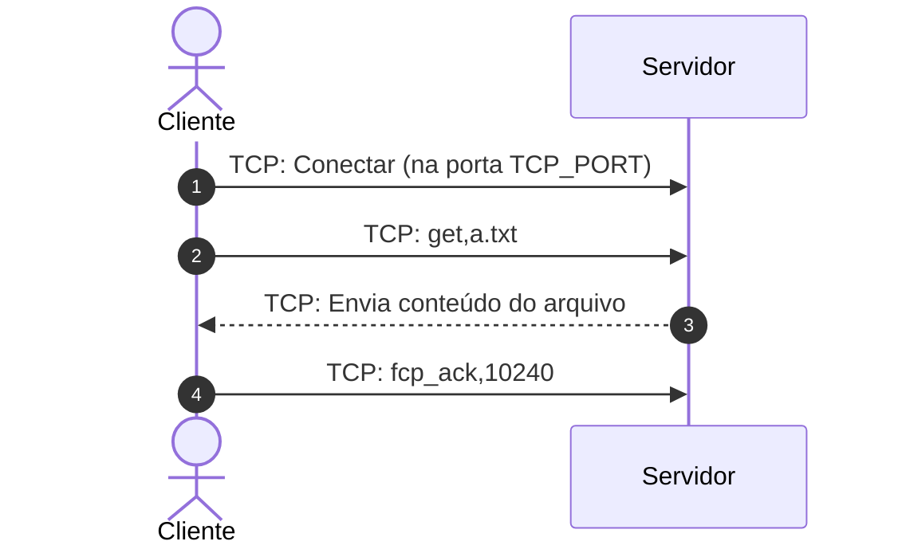

# Relatorio do Grupo ( G9 )

 - Copiando config.ini
- Iniciando o servidor: servidor_ftcp.py
 - Servidor iniciado com PID: 31372
 - Saída do servidor salva em: server_output_G9.log

## Arquivos do Grupo

- Arquivo a.txt - Bytes: Arquivo não encontrado, KBytes: Arquivo não encontrado
- Arquivo b.txt - Bytes: Arquivo não encontrado, KBytes: Arquivo não encontrado

> Os arquivos não encontrados não chegou a ser um problema. Trata-se apenas que os arquivos não estavam no local esperados (não a desconto de pontuação)
> 
## Execucao do cliente

### get a.txt
```
Inciando Negociacao
	 - Utilizando  127.0.0.1:30001 (UDP)
	 - Mensagem : REQUEST,TCP,a.txt
	 - HEX UDP: 524551554553542c5443502c612e747874
	 - Resposta UDP: 466f726d61746f206465206d656e736167656d20696e76c3a16c69646f2028746f6f206d616e792076616c75657320746f20756e7061636b2028657870656374656420322929
	 - Messagem decodificada : too many values to unpack (expected 2)
Erro no UDP: list index out of range
```
### get b.txt
```
Inciando Negociacao
	 - Utilizando  127.0.0.1:30001 (UDP)
	 - Mensagem : REQUEST,TCP,b.txt
	 - HEX UDP: 524551554553542c5443502c622e747874
	 - Resposta UDP: 466f726d61746f206465206d656e736167656d20696e76c3a16c69646f2028746f6f206d616e792076616c75657320746f20756e7061636b2028657870656374656420322929
	 - Messagem decodificada : too many values to unpack (expected 2)
Erro no UDP: list index out of range
```
Servidor encerrado.

## Comentarios

O protocolo implementado pelo grupo pode ser utilizado pelo cliente de referência e foi capaz de ;

- ➕➖ Realiza a etapa de neogociação
- ✅    Transfere os arquivos via TCP
- ❌    Encerra a conexão TCP com os parametros corretos

Adiconalmente, o grupo utiliza um pool de portas TCP para realizar a transferencia.

### Explicações

🔔 **Importante** : Caso algum dos comentarios esteja presente no código me enviem um e-mail apontando para eu rever a correção.


#### 📌 Etapa de neogociação

A negociação é realizada porem não de acordo com o protcolo, a menssagem especificada é :

```
	<COMANDO>,<PROTOCOLO>,<TRANSFER_PORT>,<ARQUIVO>
```
Ou seja, o cliente deve enviar algo com `REQUEST,UDP,a.txt` e o servidor trata o comando, protcolo e o arquivo. Contudo, a implementação do servidor **não considerando o comando**, onde o sliper `nome_arquivo, protocolo = mensagem.split(",")` a atribuição do split a execeção `(too many values to unpack (expected 2))` ao receber a menssagem com o comando (`REQUEST`).

```python
# Loop principal do servidor
while True:
    dados, endereco = sock.recvfrom(1024)
    mensagem = dados.decode().strip()
    print(f"[UDP] Mensagem recebida de {endereco}: {mensagem}")

    try:
        nome_arquivo, protocolo = mensagem.split(",")
```

Desse modo quando o **cliente de referência** é utilizado temos o seguinte log do servidor

```log
	Servidor configurado com TCP_PORT_START=60002, TCP_PORT_END=60100 e UDP_PORT=30001
	[UDP] Servidor escutando na porta 30001
	[UDP] Mensagem recebida de ('127.0.0.1', 52478): REQUEST,TCP,a.txt
	[UDP] Resposta enviada para ('127.0.0.1', 52478): Formato de mensagem inválido (too many values to unpack (expected 2))
```

Por sua vez ao utilizar o **cliente do grupo** é  temos o seguinte log do servidor

```log
	Servidor configurado com TCP_PORT_START=60002, TCP_PORT_END=60100 e UDP_PORT=30001
	[UDP] Mensagem recebida de ('127.0.0.1', 37595): a.txt,TCP
	[UDP] Resposta enviada para ('127.0.0.1', 37595): 60002
	[TCP] Escutando na porta 60002 para enviar a.txt
	[UDP] Mensagem recebida de ('127.0.0.1', 49581): a.txt,TCP
	[UDP] Resposta enviada para ('127.0.0.1', 49581): 60003
	[TCP] Escutando na porta 60003 para enviar a.txt
```

Repare que `[UDP] Mensagem recebida de ('127.0.0.1', 37595): a.txt,TCP` a menssangem recebida não consta o comando (`REQUEST`).

Em tempo, o cliente tambem esta utilizando escutando portas TCP. Tal fato, apesar de não usal, não gera penalidade na nota. Contudo, **isso pode explicar o fato que vocês relataram que o socket já estava em uso ao testar no wireshark**.

#### 📌 Etapa de finalização do conexão

Observando o trafego e código não percebi a etapa de finalização da conexão (`fcp_ack`), passo 3 da Etapa 2 do [procolo](../protocolo.md), onde o cliente comunica o numero de bytes recebidos para o servidor.




PS: Caso esta etapa esteja presente no código me enviem um e-mail apontando para eu rever a correção.

